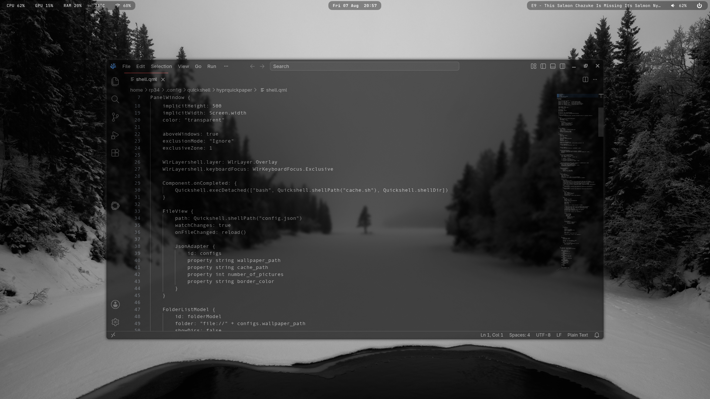
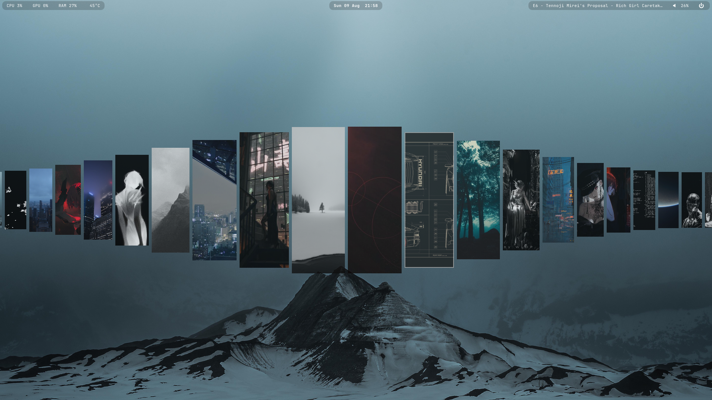

## Simple Hyprland Rice

**Full showcase: https://www.youtube.com/watch?v=kYZ5mkGuQEg**

Simple and minimal Hyprland setup focused on practical keybinds, productivity, and a smooth workflow easy to customize

Feel free to use as inspiration or as a starting point for building your own setup.






## Features

* Waybar
> Change volume with mouse wheel, play/pause and next media
* Rofi
> App search, clipboard history and switch opacity
* Hyprlock
* Wlogout
* Custom wallpaper selector
* Custom scripts
* Spotify + Spicetify

### Wallpaper Selector

[hyprquickpaper](https://github.com/iamsurjog/hyprquickpaper)

> check out the original source I just made changes to it 

### Most used keybinds

> **$mod = Super / Windows key**

**Applications**

| Keybind     | Action                    |
| ----------- | ------------------------- |
| `Super + T` | Open terminal             |
| `Super + D` | Open application launcher |
| `Super + E` | Open file manager         |
| `Super + B` | Open browser              |
| `Super + W` | Open wallpaper selector   |

```ini
hl.bind(mainMod .. " + W", hl.dsp.exec_cmd("quickshell -c hyprquickpaper"))
```
**Window Management**

| Keybind         | Action              |
| --------------- | ------------------- |
| `Super + Q`     | Close active window |
| `Super + F`     | Toggle fullscreen   |
| `Super + Space` | Toggle floating     |
| `Super + Tab`   | Lock screen         |
| `Super + Esc`   | Open logout menu    |
| `Super + O`     | Switch opacity      |
```ini
hl.bind(mainMod .. " + Escape", hl.dsp.exec_cmd("wlogout -b 1 -c 20 -r 20 -L 1700 -R 1700 -T 325 -B 325"))
```
```ini
hl.bind(mainMod .. " + O", hl.dsp.exec_cmd(home .. "/.config/hypr/scripts/opacity.sh"))
```
**Mouse move/resize**
```ini
hl.bind(mainMod .. " + mouse:272", hl.dsp.window.drag(), { mouse = true })
```
```ini
hl.bind(mainMod .. " + mouse:273", hl.dsp.window.resize(), { mouse = true })
```
**Waybar**

| Keybind             | Action        |
| ------------------- | ------------- |
| `Super + Shift + W` | Toggle Waybar |

Waybar is completely stopped when hidden and started again when enabled.

```ini
hl.bind(mainMod .. " + SHIFT + W", hl.dsp.exec_cmd("sh -c 'pgrep -x waybar >/dev/null && pkill waybar || nohup waybar >/dev/null 2>&1 &'"))
```

**Screenshots**

| Keybind          | Action                               |
| ---------------- | ------------------------------------ |
| `Super + Delete` | Screenshot entire screen             |
| `Delete`         | Select an area and take a screenshot |

**Clipboard**

| Keybind     | Action                 |
| ----------- | ---------------------- |
| `Super + V` | Open clipboard history |

Uses `cliphist`, `rofi`, and `wl-copy`.

```ini
hl.bind(mainMod .. " + V", hl.dsp.exec_cmd("cliphist list | rofi -dmenu | cliphist decode | wl-copy"))
```

---

### Installed Programs:

```text
Hyprland
Waybar
Rofi
Hyprlock
Wlogout
Quickshell
awww
Grim
Slurp
Cliphist
wl-clipboard
```

---

**Clone the repository:**

> **Note:** Some paths and applications are specific to my setup. You may need to modify the configuration files to match your system.

```bash
git clone https://github.com/43PR/dotfiles.git
cd dotfiles
```

Back up your existing configuration

```bash
git clone https://github.com/43PR/dotfiles.git
cd dotfiles
```

Create the `.config` directory if it doesn't already exist:

```bash
mkdir -p ~/.config
```

Copy the configuration files:

```bash
cp -r .config/* ~/.config/
```

Restart Hyprland or log out and back in.

---

* [hyprquickpaper](https://github.com/iamsurjog/hyprquickpaper)
* [samaritan-sddm-theme](https://github.com/omerwk/samaritan-sddm-theme)


